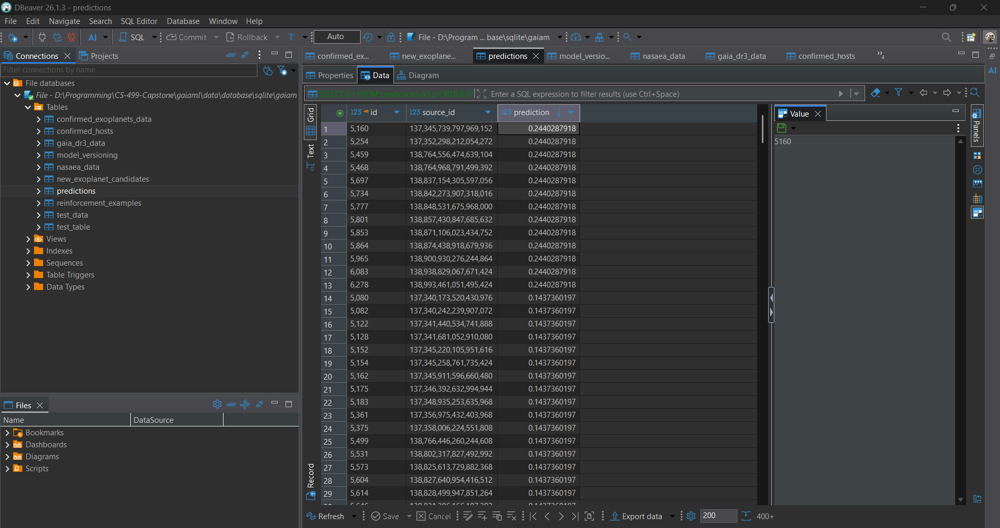
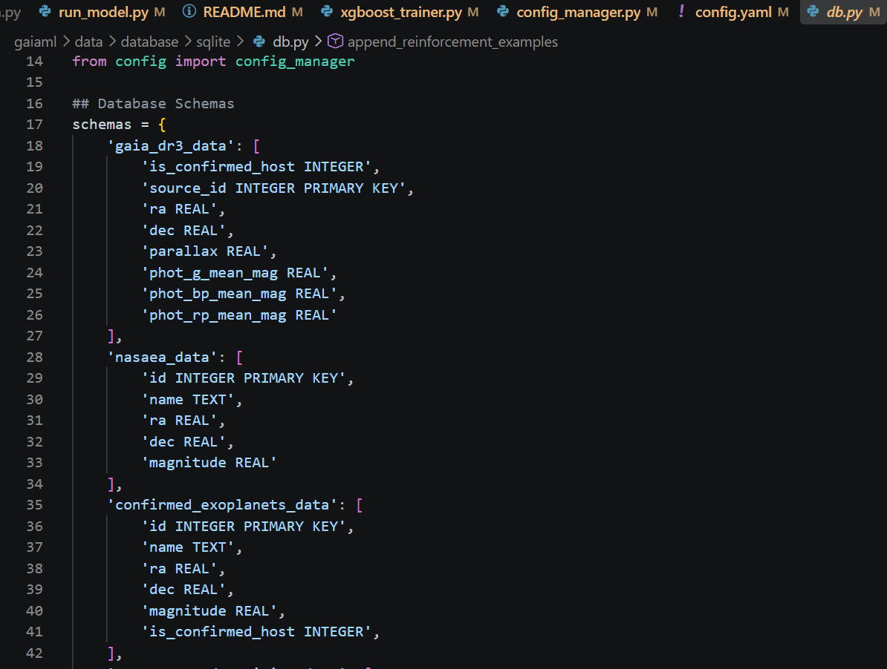
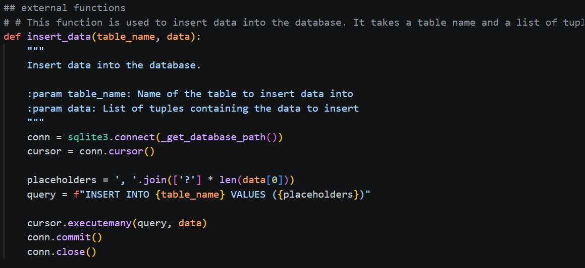

## Artifact
	The artifact I selected for demonstrating the Databases milestone is also GaiaML, a modular Python application developed as an enhancement of an earlier machine-learning project. The original artifact was a monolithic Jupyter Notebook that used Keras to train a simple agent to solve a single predefined maze. The original application was primarily intended as a demonstration of machine-learning concepts and did not require persistent data storage.
During CS-499, I substantially redesigned and expanded this artifact into GaiaML, a scientific machine-learning application designed to analyze astronomical data from the Gaia Data Release 3 (DR3) and cross-reference that information with confirmed exoplanet hosts within the same catalogue. The enhanced application includes data acquisition, preprocessing, feature engineering, machine-learning analysis using XGBoost and mechanisms for storing and analyzing the resulting data.

## Selection and Enhancement
	I selected this artifact because it provided an opportunity to demonstrate substantial growth from the original project rather than simply presenting an existing application with minor modifications. The original maze-solving project was intentionally small and self-contained, while GaiaML required a significantly more complex architecture capable of managing persistent datasets and supporting multiple stages of analysis.
One of the most significant limitations of the original artifact was the absence of a persistent data-storage solution. The original application could perform its intended task entirely within a notebook execution, but GaiaML needs to manage astronomical datasets that are reused across preprocessing, feature engineering, training and analysis. Requiring the application to repeatedly treat these datasets as temporary in-memory information would make the system more difficult to maintain, reproduce and extend.
To address this limitation, I implemented SQLite as the persistent database solution for GaiaML. I selected SQLite because it provides a relational database system without requiring a separate database server or extensive deployment configuration. SQLite is lightweight, portable and accessible through Python's built-in sqlite3 module, making it appropriate for the current scope and intended use of GaiaML. This decision demonstrated that database selection should be based on the requirements of a project rather than simply selecting the most powerful or complex database technology available.

I also created a database utility layer around Python's sqlite3 functionality. This layer separates database operations from the rest of the application, allowing other GaiaML components to interact with persistent data without needing to directly manage database connections and low-level SQL operations. This approach preserves the modular architecture of the application and provides a centralized location for database functionality. 

As a result, future database-related changes can be made without requiring the machine-learning and data-processing components to directly depend on the implementation details of the database.
The database enhancement also required me to consider how different types of information should be represented and persisted. GaiaML works with source astronomical data, processed data, engineered features and machine-learning results. Organizing these different forms of information into a relational structure required me to consider relationships between data, appropriate storage boundaries and how information would be retrieved by different parts of the application. This was a significant change from the original notebook, where data was primarily handled as part of the immediate execution of the program.
	
## Skills and Learning
The database enhancement strengthened my understanding of relational database design and demonstrated skills that were not present in the original artifact. I gained practical experience using SQL and Python's sqlite3 interface to create a persistent data layer for an application. More importantly, I learned that database development involves more than storing information. The database structure must support the requirements of the application while maintaining an appropriate separation between persistent data and application logic.
I also developed a stronger understanding of abstraction and modularity. Rather than placing SQL statements and database connection logic throughout GaiaML, I created a utility layer that provides a consistent interface for database operations. This helped reinforce the software-engineering principle that individual components should have clearly defined responsibilities. The machine-learning components should be concerned with analysis, while the database layer should be responsible for persistence and retrieval only.
Another important lesson was the importance of selecting tools according to project requirements. A server-based database such as MySQL or PostgreSQL could provide additional capabilities, but those capabilities would also introduce additional infrastructure and deployment requirements. For the current version of GaiaML, SQLite provides the persistence and relational functionality the application requires to test the machine-learning pipeline without unnecessary infrastructure. This helped me better understand the tradeoff between capability and complexity when selecting technologies for a software project.
The database enhancement also reinforced the importance of persistent data in scientific computing. Machine-learning results are more useful when the data used to produce them can be retained, examined and reused. By adding persistent storage, GaiaML can maintain information across separate executions instead of treating each analysis as an isolated experiment. This supports the application's larger goal of creating a reproducible and extensible scientific data-analysis workflow.

## Course Outcomes
	I met the planned course outcome for this enhancement: 
    
**Demonstrating an ability to use well-founded and innovative techniques, skills and tools in computing practices to implement computer solutions that deliver value and accomplish industry-specific goals.**

I demonstrated this outcome by evaluating the requirements of GaiaML and selecting SQLite as an appropriate database technology for the current application. Rather than adding a database solely as a feature, I used persistent relational storage to address an architectural limitation created by the transition from a small machine-learning demonstration to a scientific data-analysis application.

The database utility layer also demonstrates the application of modular software-development practices. By separating database access from the machine-learning and data-processing components, GaiaML is easier to maintain and provides a clearer foundation for future development. The enhancement therefore addressed both the immediate need for persistent data and the longer-term need for an architecture that can continue to evolve.

## Reflection
	The most important lesson I gained from this enhancement was that database design is closely connected to the overall architecture of an application. Before working on GaiaML, the original project did not require me to think about persistent data because the entire application could operate as a single notebook-based experiment. Transforming that project into GaiaML forced me to consider what information needed to persist, how that information should be organized and how different application components should interact with it.
One of the challenges was determining how to introduce database functionality without undermining the modular architecture I was developing elsewhere in the project. Implementing a database directly inside individual processing or machine-learning components would have made those components more dependent on the storage implementation. Creating a dedicated database utility layer provided a better separation of responsibilities and gave me practical experience applying abstraction to a real application rather than only discussing the concept theoretically.
The current SQLite implementation is also intentionally not the final possible architecture for GaiaML. As the project grows, I envision moving toward a cloud-based architecture with a single-page application (SPA) front end and a dedicated backend API. At that point, a server-based or cloud-hosted database solution would likely be more appropriate than SQLite. A larger deployment could require concurrent users, remote access, authentication, more advanced database management, automated backups and greater scalability. Technologies such as PostgreSQL could therefore become more appropriate as the project evolves.
This future direction also helped me understand why technology decisions should be based on current requirements rather than assumptions about future scale. SQLite is an appropriate solution for the current local, modular version of GaiaML, while a cloud-based relational database could become appropriate when the application's deployment requirements change. Designing the current database layer behind an abstraction also makes that eventual transition more manageable because the rest of the application does not need to be tightly coupled to SQLite's implementation details.
Overall, this enhancement changed my understanding of databases from viewing them primarily as a method of storing application data to understanding them as an architectural component of a larger computing solution. GaiaML required me to apply database design, SQL, persistence, abstraction and technology-selection skills to a practical scientific computing problem. This experience provided a foundation that I can continue building upon as GaiaML evolves from a local research-oriented application toward a potentially distributed, cloud-based system.
