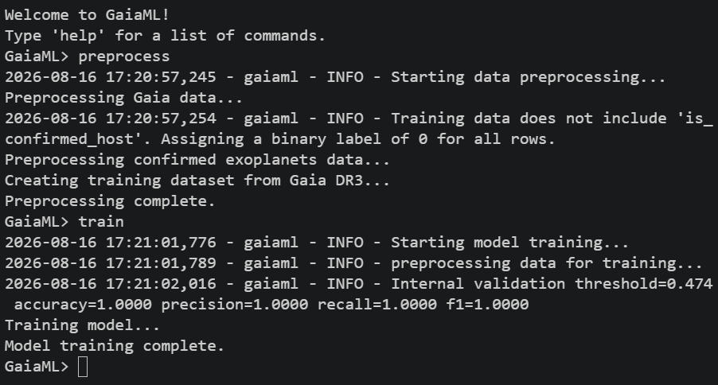
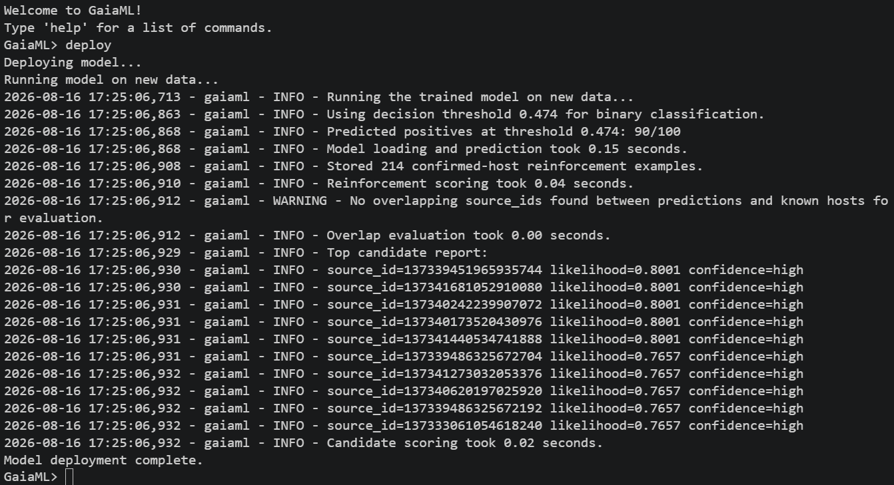
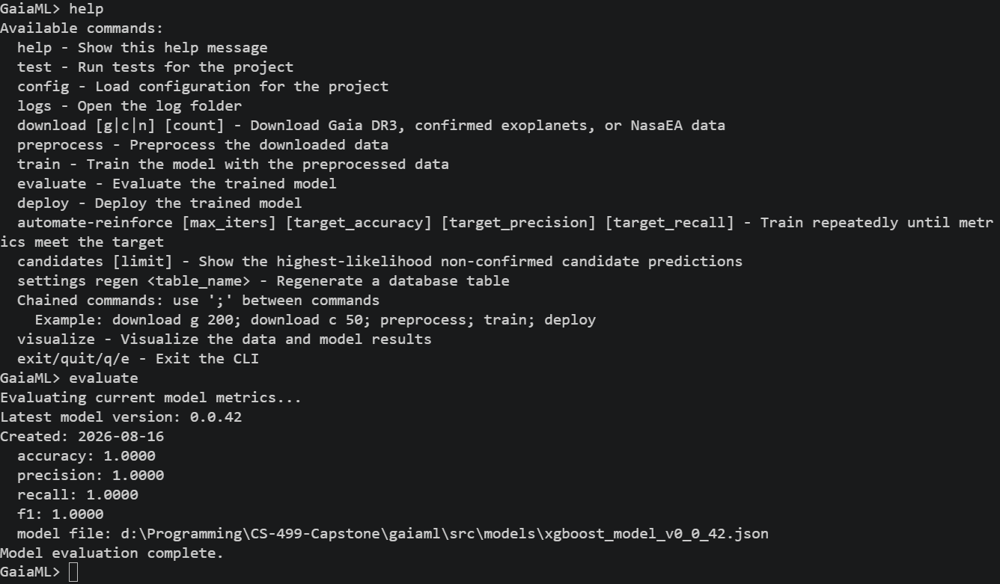

## Artifact

	The selected artifact is GaiaML, a modular Python machine learning application designed to analyze astronomical data from the Gaia Data Release 3 (DR3) archive and identify stellar systems that exhibit characteristics associated with known exoplanet host stars. The artifact originated from the Pirate Intelligent Agent project completed in CS-370, which used a relatively simple machine learning workflow within a monolithic Jupyter Notebook. The original project demonstrated the basic use of machine learning through Keras, but its architecture and analytical approach were not designed for repeated training, feature experimentation, model evaluation, or application to large scientific datasets.

    The enhanced version transforms the original proof-of-concept into a modular command-line application that retrieves astronomical data, preprocesses and engineers numerical features, trains an XGBoost classification model, evaluates model performance and applies the trained model to previously unseen Gaia DR3 data. The primary purpose of the enhancement for the Algorithms and Data Structures category was to improve the analytical and computational approach used to classify candidate exoplanet host systems.

## Justification and Changes

	GaiaML was selected for the Algorithms and Data Structures category because the enhancement significantly changes how the application processes and classifies astronomical data. The original implementation did not contain a complete algorithmic pipeline capable of training and evaluating a predictive model against real astronomical observations. It primarily demonstrated the intended interaction between components and used a simplified workflow rather than a reusable classification system.

    The primary limitation of the original approach was that it did not provide a method for transforming raw Gaia observations into a feature space optimized for machine learning classification. Raw astronomical datasets contain measurements with different numerical scales, distributions and relationships. Directly using these values without preprocessing can reduce model performance and make it more difficult to identify meaningful relationships between known host stars and the much larger population of unconfirmed systems.

    To address this limitation, the enhancement introduced a preprocessing and feature engineering pipeline combined with an XGBoost gradient-boosted decision tree classifier. The preprocessing stage converts downloaded tabular data into a consistent numerical representation, removes or handles unusable values, normalizes applicable features and derives additional features from relationships within the Gaia dataset. These engineered features are then used as the input representation for the classification algorithm.

    XGBoost was selected because the Gaia dataset is structured primarily as large-scale tabular data. Gradient-boosted decision trees are well suited to datasets containing nonlinear relationships and interactions between numerical features. Unlike a simple baseline classifier that may rely on a single decision boundary or assume linear relationships between features, gradient boosting constructs an ensemble of decision trees in which successive trees attempt to correct errors produced by previous trees. This allows the model to learn more complex relationships between the characteristics of confirmed host stars and non-host stars.

    The enhancement also changes the way data is managed during training and deployment. Rather than repeatedly loading and manually manipulating raw datasets within a notebook, the application stores downloaded, preprocessed and predicted data in structured SQLite tables. Pandas DataFrames are used during preprocessing and model input because they provide efficient tabular structures for vectorized operations, while SQLite provides persistent storage and indexed access to the different stages of the data pipeline. This separation reduces repeated preprocessing and allows trained models and predictions to be reused without reconstructing the entire workflow.

### The resulting algorithmic pipeline can be summarized as follows:

**Raw Gaia DR3 Data → Data Cleaning → Feature Engineering → Structured Feature Matrix → XGBoost Training → Model Evaluation → Classification of Unseen Data → Candidate Ranking and Storage**

    The major improvement is therefore not simply the addition of new application features. The enhancement replaces a simplified machine learning demonstration with a reusable predictive pipeline that transforms raw astronomical observations into an engineered feature matrix and uses gradient-boosted trees to perform nonlinear classification.

    The primary tradeoff introduced by this approach is computational complexity. XGBoost requires more processing time and memory than simpler baseline models because it constructs multiple decision trees during training. Additional preprocessing and feature engineering also increase the computational cost of preparing the dataset. However, these costs are justified by the ability of the model to learn more complex feature relationships and to provide a stronger predictive approach for large tabular datasets.

    The effectiveness of the enhancement was evaluated using model performance metrics including accuracy, precision, recall, F1 score and average training runtime. The final XGBoost model, following the implementation of advanced feature engineering and preprocessing, achieved an accuracy of 0.99, precision of 0.99, recall of 0.85 and an F1 score of 0.95, with an average training runtime of less than five minutes.

    In comparison, the initial model developed before the implementation of advanced feature engineering achieved an accuracy of 0.00 and precision of 0.10. The baseline implementation did not include recall, F1 score, or runtime measurements, which limited the ability to comprehensively evaluate its predictive performance.

    The substantial improvement in accuracy and precision, combined with the strong recall and F1 score achieved by the enhanced model, provides measurable evidence that the revised preprocessing, feature engineering and XGBoost classification pipeline significantly improved GaiaML's ability to distinguish known exoplanet host systems from non-host systems. The primary tradeoff introduced by this enhancement was increased computational complexity and training time; however, the model was still able to complete training in less than five minutes on the selected dataset, making the improvement practical for the application's intended workflow.
	

## Course Outcomes

The enhancement demonstrates the following course outcomes.

**Design and evaluate computing solutions that solve a given problem using algorithmic principles and computer science practices and standards appropriate to its solution, while managing the trade-offs involved in design choices**

The GaiaML enhancement applies algorithmic principles to the problem of identifying potential exoplanet host systems within large astronomical datasets. The original simplified workflow was expanded into a structured machine learning pipeline that transforms raw observations into engineered features and applies a gradient-boosted classification algorithm to identify systems with characteristics similar to confirmed host stars.

The design process required evaluating the tradeoff between computational cost and predictive capability. Simpler classification approaches may require fewer resources, but they may not capture nonlinear relationships and interactions within astronomical measurements. XGBoost increases training complexity but provides a more flexible algorithm for structured numerical data.

**Demonstrate an ability to use well-founded and innovative techniques, skills and tools in computing practices for the purpose of implementing computer solutions that deliver value and accomplish industry-specific goals**

The enhanced application uses established machine learning practices including data preprocessing, feature engineering, supervised classification, model persistence and evaluation of predictive performance. The use of XGBoost provides an industry-standard gradient boosting implementation capable of processing structured datasets efficiently.

The application also separates raw data, processed features, model metadata and predictions into persistent data structures. This allows the analytical pipeline to be repeated and evaluated using new datasets without requiring the entire workflow to be manually reconstructed.

## Reflection

	The most significant lesson from this enhancement was the difference between adding functionality to an application and improving the underlying computational approach used to solve a problem. During the development of GaiaML, I initially focused heavily on application architecture, including modularization, database storage, command-line functionality and model persistence. While these improvements made the application more usable and maintainable, the strongest contribution to the Algorithms and Data Structures category was the implementation of the analytical pipeline itself.

    The development process required determining how raw Gaia DR3 measurements could be transformed into useful machine learning features. This involved researching the available astronomical parameters, handling missing or inconsistent values and developing a preprocessing pipeline capable of producing a consistent feature matrix for both training and prediction.

    Implementing XGBoost also required consideration of how the training data was structured. The model needed examples of confirmed exoplanet host systems and representative non-host data in order to learn a meaningful classification boundary. The feature engineering process was therefore important because the quality and representation of the input data directly affected the predictive capability of the algorithm.

    One challenge was balancing model complexity with the computational limitations of processing large astronomical datasets. Gaia DR3 contains an extremely large number of observations, making it impractical to load and process the entire archive during development. The application therefore uses selected samples and queries to retrieve manageable subsets for preprocessing and model training. This introduces a tradeoff between computational efficiency and the amount of available training data.
    
    Another challenge involved validating the effectiveness of the model. A machine learning system cannot be considered an improvement simply because it produces predictions. The enhanced system must be evaluated using measurable performance metrics such as accuracy, precision, recall, F1 score and runtime metrics. This evaluation process provides evidence of whether the algorithm is successfully generalizing beyond its training data.

    Overall, this enhancement changed GaiaML from a conceptual machine learning demonstration into a reusable analytical system. The most important improvement was not the addition of a database or command-line interface, but the implementation of a structured feature engineering and gradient-boosted classification pipeline capable of training on known astronomical systems and evaluating previously unseen observations. The project also demonstrated the importance of measuring algorithmic performance and considering the tradeoffs between predictive capability, computational cost and dataset size.
